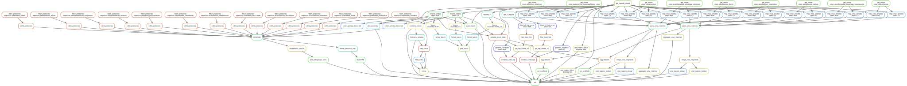

# _Acanthamoeba castellanii_ genome assembly and analysis

> TODO: Define conda environments for the remaining rules to minimize dependencies

## Description 
This repository contains scripts and documentation related to the analysis and comparison of the _Acanthamoeba castellanii_ genome from strains C3 and Neff. 

## Usage

 The analyses are separated into distinct workflows in the `rules` directory.
 The whole analysis pipeline can be run using snakemake (data not available yet):

 ```snakemake --use-conda -j4```

## Structure

The master script `Snakefile` will call each workflow one after the other. Each workflow contains rules with input and output files, which execute code or external scripts. Each rule is executed in its own conda environment and will download its dependencies on the first execution. The overall workflow can be represented as a graph:



The `envs` directory contains conda environment build specifications for the different rules.

General parameters for the pipeline are stored in the `config.yaml` file and can be modified. The strains to analyze as well as the path to their sequence files are defined in `samples.tsv`. All external scripts executed by rules are stored in the `scripts` folder. Custom python utility libraries imported in the pipeline are stored in `src`.

The `doc` directory contains jupyter notebook with general analyses of the pipeline results.

## Requirements:

* python3.7+
    + snakemake
    + pandas
    + numpy
    + biopython
    + seaborn
    + matplotlib
    + matplotlib-venn
    + cooler
    * chromosight
* conda
* dnaglider
* blast+
* bedtools
* MCScanX

