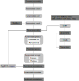

## A. castellanii genome annotation pipeline
**cmdoret, 20190419**

### Overview

This document describes the pipeline we used for _de novo_ annotation of the _Acanthamoeba castellanii_ genome. Only the Neff strain is currently (June 2019) annotated, C3 is on the way. The whole annotation pipeline uses [funannotate](https://github.com/nextgenusfs/funannotate/tree/1.5.3) (10.5281/zenodo.2604804) to combine the output of multiple tools.




### Commands

1. Data cleaning and preparation:
The headers were cleaned, contigs sorted by size and the genome was masked using repeatmasker with repbase through the funannotate wrapper.

```bash
funannotate clean -i 09_Ac_neff_pilon2.fa -o Ac_neff_clean.fa
funannotate sort -i Ac_neff_clean.fa -o Ac_neff_clean_sorted.fa
funannotate mask -i Ac_neff_clean_sorted.fa \
                 -o Ac_neff_sm.fa \
                 -s 'acanthamoeba castellanii' \
                 --cpus 12
```

2. Evidence preparation
We used a publicly available RNAseq library of _A.castellanii_ Neff to provide gene evidence for the annotation. The reads were mapped using STAR and transcripts assembled using Trinity.

```bash
# Generate STAR genome index
STAR --runThreadN 12 \
     --runMode genomeGenerate \
     --genomeFastaFiles Ac_neff_sm.fa \
     --genomeDir .

# Align reads to genome using STAR (2.7.0f)
STAR --runThreadN 12 \
     --genomeDir genome \
     --readFilesIn SRR5192860_Acastellanii_neff_rnaseq.fastq \
     --outFileNamePrefix Ac_neff_RNA
# Sort output alignment by coord, get in BAM format and index it
samtools sort -O BAM -o Ac_neff_RNA.bam -@ 12 Ac_neff_RNAAligned.out.sam2
samtools index Ac_neff_RNA.bam

# Make transcripts using trinity (v2.1.1)
 Trinity --genome_guided_bam rnaseq.coordSorted.bam \
         --genome_guided_max_intron 10000 \
         --max_memory 10G --CPU 10 
```

3. Gene prediction
Automated gene prediction by Genemark ES and Augustus was then run through funannotate using the assembled transcripts to train the predictors.

```bash
# First, download Eukaryote BUSCOs
funannotate setup -b eukaryota
# Run gene prediction
funannotate predict -i genome/Ac_neff_sm.fa \
                    --species "Acanthamoeba castellanii" \
                    --strain Neff \
                    --transcript_evidence trinity_out_dir/Trinity-GG.fasta \
                    --rna_bam Ac_neff_RNA.bam \
                    -o predict_out \
                    --cpus 12 \
                    --busco_db eukaryota \
                    --optimize_augustus
```


4. Functional annotation
Running Interproscan and phobius remotely to retrieve functional annotations. eggNOG-mapper was ran independently through the web front end to predict GO annotations.

```bash
#using remote search for interproscan, phobius and antismash
funannotate remote -i predict_out \
                   -m interproscan phobius \
                   -e my@email.com
```

5. Combining annotations
Finally, results from previous steps were incorporated into the annoations using `funannotate annotate`.

```bash
funannotate annotate --gff predict_out/predict_results/Acanthamoeba_castellanii_Neff.gff3 \
                    --fasta predict_out/predict_results/Acanthamoeba_castellanii_Neff.scaffolds.fa \
                    -s 'Acanthamoeba castellanii' \
                    --cpus 12 \
                    --eggnog predict_out/Ac_Neff.proteins.fa.emapper.annotations \
                    --busco_db eukaryota \
                    --out annotate_out \
                    --phobius predict_out/annotate_misc/phobius.results.txt \
                    --iprscan predict_out/annotate_misc/iprscan.xml
```