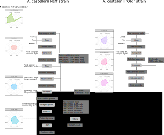

## A. castellanii genome assembly pipeline
**cmdoret, 20190419**

### Overview

This document describes the pipeline we used for _de novo_ assembly of the _Acanthamoeba castellanii_ genome. We assemble Strains "Neff" and "C3". The general workflow is to first assemble using long reads, then polish the draft assembly with short reads and reassemble it using Hi-C data.




### Commands

1. Basecalling
Performed basecalling was performed to generate fastq files using guppy (v2.3.1-1) in a docker container with GPU acceleration. 

Setting up an interactive session in the guppy container using:

```bash
docker run --rm \
           --runtime=nvidia \
           --name=ONT_basecalling \
           -i -t \
           -v $(pwd):/data \
           cmdoret/guppy:latest /bin/bash
```

The command used from the container is:
```bash
guppy_basecaller \
  -i /data/fast5/20190219_Acastellanii_neff/fast5 \
  -s /data/fq/20190221_Acastellanii_neff_ONT_guppy_2.3.1-1/ \
  -c dna_r9.4.1_450bps.cfg
```
2. Indexing ONT reads
ONT reads were indexed with nanopolish (v0.11.0) in a docker container.
Nanopolish index was run from the container using:

```bash
docker run -v $(pwd):/data/ \
           -it cmdoret/nanopolish:0.11.0 \
           ./nanopolish index \
           -d /data/fast5/20190219_Acastellanii_neff/fast5 \
           /data/fq/Acastellanii_neff_ONT_merged.fq
```

3. Long reads assembly:
Genome was assembled _de novo_ from Oxford Nanopore reads using Canu (v1.8 +137 changes (r9347)).

First, reads were corrected:
```bash
canu -correct \
     -d output/canu/Acastellanii_neff \
     -p Acastellanii_neff \
     -nanopore-raw fq/Acastellanii_neff_ONT_processed.fq \
     genomeSize=40m
```
Then trimmed:
```bash
canu -trim \
  -p Acastellanii_neff \
  -d output/canu/Acastellanii_neff \
  genomeSize=40m \
  -nanopore-corrected output/canu/Acastellanii_neff/Acastellanii_neff.correctedReads.fasta.gz
```
Then assembled:
```bash
canu -trim \
  -p Acastellanii_neff \
  -d output/canu/Acastellanii_neff \
  genomeSize=40m \
  -nanopore-corrected output/canu/Acastellanii_neff/Acastellanii_neff.correctedReads.fasta.gz
```

4. Long reads polishing:
The original ONT reads were then realigned to the draft genome:
```bash
minimap2 -ax map-ont -t 12 \
             output/canu/Acastellanii_neff/Acastellanii_neff.contigs.fasta \
             fq/Acastellanii_neff_ONT_merged.fq \
    | samtools sort -@ 12 -O BAM \
    > bam/Acastellanii_neff_ONT_to_draft.bam

# index bam file
samtools index -@ 12 bam/Acastellanii_neff_ONT_to_draft.bam
```
Using nanopolish variants to get all variants between the draft and reads consensus info vcf files:
```bash
 python Repos/nanopolish/scripts/nanopolish_makerange.py \
        output/canu/Acastellanii_neff/Acastellanii_neff.contigs.fasta \
    | parallel --results nanopolish.results -P 6 \
               docker run -v $(pwd):/data/ \
                      -i nanopolish ./nanopolish variants --window {1} \
                      --threads 2 \
                      --consensus \
                      --min-candidate-frequency 0.1 \
                      --reads /data/fq/Acastellanii_neff_ONT_merged.fq \
                      --ploidy 2 \
                      --genome /data/output/canu/Acastellanii_neff/Acastellanii_neff.contigs.fasta \
                      --bam /data/bam/Acastellanii_neff_ONT_to_draft.bam \
                      --outfile /data/vcf/Acastellanii_neff_draft_ONT_consensus.{1}.vcf

# Get a list of all VCF file names generated by nanopolish
find ./vcf/ > vcf_files.txt
# !! Prepend docker mountpoint to each path
sed -i 's|\./vcf|/data/vcf|g' vcf_files.txt
```
Combining VCF files with the draft genome to obtain a corrected FASTA:
```bash
docker run -v $(pwd):/data/ \
           -i nanopolish ./nanopolish vcf2fasta \
           -g /data/output/canu/Acastellanii_neff/Acastellanii_neff.contigs.fasta \
           --fofn=/data/vcf_files.txt \
           > /data/output/nanopolish/Acastellanii_neff.ONT_polished.contigs.fasta \
           > 2> /data/output/nanopolish/Acastellanii_neff.ONT_polished.contigs.log
```

5. Short reads polishing
Short reads polishing was done using pilon and then racon-illumina. For the Neff strain, Illumina runs SRR7769837, SRX216147 and SRX216149 were used.

```bash
# Aligned all 3 banks with minimap2 first
#Running on an HPC with SLURM 
module add java/1.7.0
module add pilon/1.22
sbatch -N1 -n8 --mem 64G --wrap='\
  java -Xmx60G  -jar /local/gensoft2/exe/pilon/1.22/libexec/pilon.jar \
  --threads 8 \
  --genome output/nanopolish/Acastellanii_neff.ONT_polished.contigs.fasta \
  --frags bam/SRR7769837_neff_ONT_polished.sorted.bam \
  --frags bam/SRX216147_neff_ONT_polished.sorted.bam \
  --frags bam/SRX216149_neff_ONT_polished.sorted.bam \
  --outdir output/pilon \
  --output Acastellanii_neff \
  --changes \
  --vcf \
  --diploid \
  --tracks \
   output/pilon/pilon_Acastellanii_neff.log'
```
Racon (1.3.2) was then used for an additional round of short read polishing:
```bash
racon_wrapper --subsample 50000000 100 \
              -u -t 12 \
              fq/neff_shotgun/all_neff_illumina.fastq.gz \
              bam/all_neff_illumina_vs_pilon_polished.sam \
              output/pilon/Acastellanii_neff/Acastellanii_neff.fasta \
              > output/racon/Acastellanii_neff_pilon_racon.fasta
```

6. Hi-C based reassembly
instagraal was then used to reassemble the genome from Hi-C data:

```bash
# Build bowtie2 index of the genome
bowtie2-build output/racon/Acastellanii_neff_pilon_racon.fasta output/racon/Acastellanii_neff_pilon_racon
# Generate the Hi-C matrix and files using hicstuff
hicstuff pipeline -t 12 -g output/racon/Acastellanii_neff_pilon_racon \
                  -o output/hicstuff/Ac_neff_pilon_racon
                  -e DpnII fq/AT338_neff_hic.end1.fastq.gz AT338_neff_hic.end2.fastq.gz
mkdir graal_input && cp output/hicstuff/Ac_neff_pilon_racon/*txt graal_input

# Perform Hi-C genome reassembly on GPU
instagraal graal_in output/racon/Acastellanii_neff_pilon_racon.fasta output/graal/Ac_neff/
instagraal-polish -m polishing \
                  -f output/graal/Ac_neff/graal_in/test_mcmc_4/genome.fasta \
                  -o output/graal/Ac_neff_polish.fa
```

7. Final Illumina polishing
After reassembly with GRAAL, the Illumina reads were reused to correct indels and local misassemblies potentially introcuced. This was done by 2 rounds of pilon:

```bash
# Realigned Illumina to the GRAAL-polished genome using minimap2 first
sbatch -N1 -n8 --mem 64G --wrap='\
  java -Xmx60G  -jar /local/gensoft2/exe/pilon/1.22/libexec/pilon.jar \
  --threads 8 \
  --genome output/graal/Ac_neff_polish.fa \
  --frags bam/SRR7769837_neff_GRAAL_polished.sorted.bam \
  --frags bam/SRX216147_neff_GRAAL_polished.sorted.bam \
  --frags bam/SRX216149_neff_GRAAL_polished.sorted.bam \
  --outdir output/pilon_graal1 \
  --output Acastellanii_neff \
  --changes \
  --vcf \
  --diploid \
  --tracks \
   output/pilon_graal1/pilon_Acastellanii_neff.log'

# Realign reads to the genome and reiterate operation.
```


### Results


**Assembly statistics**

Assembly | Ac_neff_nanopore_3C_illumina | Ac_neff_v1_Clarke | Ac_C3_nanopore_3C
|--|--|--|--|
Largest contig | 4.4Mb | 0.6Mb | 13.6Mb
Total length | 57.5Mb | 37.2Mb | 66.4Mb
GC (%) | 58.26 | 58.49 | 58.69
N50 | 1.8Mb | 0.05Mb | 0.4Mb
N75 | 1.5Mb | 0.02Mb | 0.09Mb
L50 | 13 | 197 | 24
L75 | 22 | 488 | 103
Complete BUSCO (%) | 87.79 | 78.55 | 85.48
Partial BUSCO (%) | 2.97 | 4.95 | 3.30
predicted genes (unique) | 18741 | 13403 | 21378
predicted rRNA genes | 148 + 17 part | 93 + 6 part | 183 + 28 part
